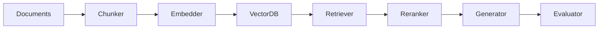

# Enterprise RAG Knowledge System

Production Retrieval-Augmented Generation pipeline designed using modular AI architecture patterns.

## Architecture

## Pipeline
documents → chunk → embed → retrieve → rerank → generate → evaluate

### Highlights
semantic chunking, 
reranking abstraction, 
confidence scoring and 
evaluation scaffold.

## License
MIT
