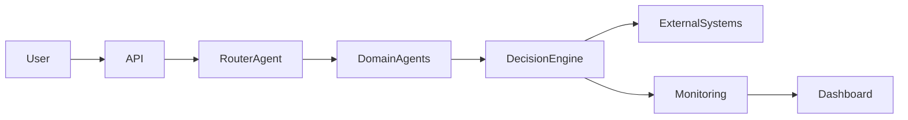

# Enterprise Rag Knowledge System

## Overview

Enterprise Retrieval-Augmented Generation platform with vector search and document reasoning.

Production-style AI architecture demonstrating distributed AI agents, orchestration workflows, and scalable infrastructure.

---

## Architecture

---

## Features

• distributed AI agents  
• containerized microservices  
• evaluation pipelines  
• Kubernetes manifests  
• CI/CD workflow  
• observability ready  

---

## Demo

---

## Run locally

pip install -r requirements.txt

python api/server.py

---

## Docker

docker compose up --build

---

## Kubernetes

kubectl apply -f k8s/

---

## License

MIT
