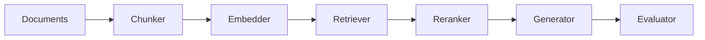

# Enterprise RAG Knowledge System

Production-style Retrieval-Augmented Generation scaffold with sentence chunking,
local hashed embeddings, hybrid retrieval, reranking, grounded answer generation,
and lightweight retrieval evaluation.

## Pipeline


```mermaid
flowchart LR
  Documents --> Chunker
  Chunker --> Embedder
  Embedder --> Retriever
  Retriever --> Reranker
  Reranker --> Generator
  Generator --> Evaluator
```

## API

- `GET /health`
- `GET /query?q=remote work policy`
- `POST /query` with `{ "query": "remote work policy" }`

## Run

```bash
pip install -r requirements.txt
python -m pytest -q
python evaluation/run_eval.py
uvicorn api.server:app --reload --port 8000
```

## Highlights

- Overlapping sentence chunking.
- Local deterministic embedding provider.
- Hybrid semantic and lexical retrieval.
- Query-aware reranking.
- Source-bearing structured responses.
- Evaluation scaffold with bundled HR policy queries.

## License

MIT
