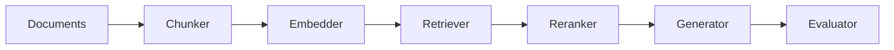

# Enterprise RAG Knowledge System

Production-style Retrieval-Augmented Generation service with sentence chunking,
local hashed embeddings, hybrid retrieval, reranking, grounded answer generation,
and lightweight retrieval evaluation.

## Pipeline


```mermaid
flowchart LR
  Documents --> Chunker
  Chunker --> Embedder
  Embedder --> Retriever
  Retriever --> Reranker
  Reranker --> Generator
  Generator --> Evaluator
```

## API

- `GET /health`
- `GET /metrics`
- `GET /events` protected when `API_KEY` is set
- `GET /query?q=remote work policy`
- `POST /query` with `{ "query": "remote work policy" }`

See `DEMO.md` for terminal demo steps, curl commands, and sample request/response files.

Set `API_KEY` to require `X-API-Key` on query/event endpoints.
Set `APP_DB_PATH` to control the SQLite event database location.

## Run

```bash
pip install -r requirements.txt
python -m pytest -q
python evaluation/run_eval.py
uvicorn api.server:app --reload --port 8000
```

With the server running, use a second terminal for the smoke check:

```bash
python scripts/smoke_test.py
```

Docker:

```bash
cp .env.example .env
docker compose up --build
```

Kubernetes manifests live in `k8s/deployment.yaml` and include probes, resource
limits, a Service, and a PVC for the SQLite event store. The default manifest
uses one replica because SQLite is the default event store.

Dockerfile, Docker Compose, and Kubernetes configuration are validated by static
inspection/YAML parsing in this workspace. Runtime container and cluster
validation remains a CI or cloud-environment step.

## Reviewer Status

- Purpose: retrieval service for source-backed HR policy answers.
- Quickstart: run tests/eval, start `uvicorn api.server:app --reload --port 8000`, then run `python scripts/smoke_test.py`.
- Demo path: use `DEMO.md` for curl examples and sample request/response files.
- Deployment status: local tests and smoke tests pass; Docker/Compose/Kubernetes config is present; Docker image builds are validated in CI; cloud deployment is pending.
- Remaining gaps: production corpus, managed retrieval infrastructure, managed auth/secrets, observability, cloud deployment, and production data governance.
- Portfolio index: https://github.com/Adityansh-Chand/ai-engineering-portfolio

## Highlights

- Overlapping sentence chunking.
- Local deterministic embedding provider.
- Hybrid semantic and lexical retrieval.
- Query-aware reranking.
- Source-bearing structured responses.
- Evaluation runner with bundled HR policy queries.
- SQLite event audit trail for query metadata.
- GitHub Actions CI for tests, eval, and container build.
- Production data contract in `datasets/production_schema.json`.

## License

MIT
